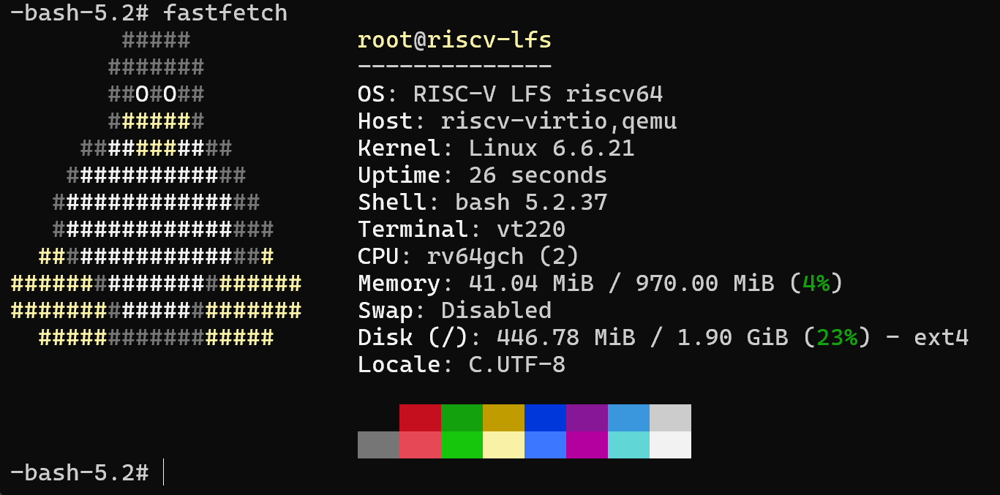

# KimmyXYC 的试炼记录

## 基本信息

- GitHub ID: KimmyXYC
- 联系邮箱: [kimmyxyc@gmail.com](mailto:kimmyxyc@gmail.com)
- rootfs 发布 Repo: [https://github.com/KimmyXYC/riscv-lfs](https://github.com/KimmyXYC/riscv-lfs)

## Rootfs 资产

- 文件名: rootfs-riscv64-lfs-kimmyxyc.tar.zst
- SHA256: 5d44a9e4908078d561b03c92c33a7275b7b7a791df62e39b689fbbb2cdd708d6
- 大小: 106M
- Image 文件名: Image
- Image SHA256: a8765bfdf2111c607440e6a00cb362072ab81338715aaaea423aa3edbe38e098

## 如何从 rootfs 运行起来

> 目标：从“下载 rootfs”到“进入环境并跑起 fastfetch”的最短步骤。验收底线：任何人下载你的 Release 资产后，按本节步骤执行，必须能跑起来。

运行前置条件：

- 宿主机为 Linux (测试环境为 WSL Ubuntu 24.04 LTS (Noble Numbat) x86\_64)
- 已安装 `qemu-system-riscv64`、`zstd`、`rsync`、`e2fsprogs`、`mount`、`sudo`
- 宿主机支持 loop 挂载 ext4 镜像

### 方式 1

1. 下载 rootfs 和 Image：

```
wget https://github.com/KimmyXYC/riscv-lfs/releases/download/v1.1.0/rootfs-riscv64-lfs-kimmyxyc.tar.zst
wget https://github.com/KimmyXYC/riscv-lfs/releases/download/v1.1.0/Image
```

2. 解压 rootfs 并写入 ext4 磁盘镜像：

```
mkdir -p rootfs
tar --zstd -xf rootfs-riscv64-lfs-kimmyxyc.tar.zst -C rootfs

truncate -s 2G lfs-riscv64.img
mkfs.ext4 -F lfs-riscv64.img

sudo mkdir -p /mnt/riscv-lfs
sudo mount -o loop lfs-riscv64.img /mnt/riscv-lfs
sudo rsync -aHAX rootfs/ /mnt/riscv-lfs/
sync
sudo umount /mnt/riscv-lfs
```

3. 启动 QEMU：

```
qemu-system-riscv64 \
  -machine virt \
  -cpu rv64 \
  -smp 2 \
  -m 1G \
  -bios default \
  -kernel Image \
  -append "root=/dev/vda rw console=ttyS0 loglevel=4 systemd.show_status=true" \
  -drive file=lfs-riscv64.img,format=raw,id=hd0,if=none \
  -device virtio-blk-device,drive=hd0 \
  -nographic
```

4. 登录与验收：

- 出现 `riscv-lfs login:` 后输入用户名 `root`
- 密码输入 `root`
- 执行 `fastfetch`
- 关机 `poweroff`

## fastfetch / neofetch 证据



## 这是如何锻造的（LFS 过程简述）

- 参考的教程/版本: `openRuyi-Tutorials/RISC-V-From-Scratch` 仓库主线文档，[Linux From Scratch - Version r13.0-5-systemd](https://linuxfromscratch.org/lfs/view/systemd/)，[Linux From Scratch - 版本 13.0-systemd-中文翻译版](https://lfs.xry111.site/zh_CN/13.0-systemd/)，[Linux LFS8.4构建教程](https://www.bilibili.com/video/BV1nt411K7zS)，GPT-5.4。
- 关键配置（toolchain / glibc / 内核 / systemd / 包策略等）:

  - 目标三元组: `riscv64-unknown-linux-gnu`
  - Binutils: `2.42`
  - GCC: `13.2.0`
  - glibc: `2.40`
  - Linux Kernel: `6.6.21`
  - systemd: `256.7`
  - bash: `5.2.37`
  - coreutils: `9.5`
  - util-linux: `2.40.2`
  - OpenSSL: `3.3.2`
  - fastfetch: `2.60.0`
- 包策略:

  - 仅保留可启动、可登录、可运行 `fastfetch` 的最小根文件系统

## 你踩过的坑

- 坑 1: 宿主污染，混入宿主工具链、宿主路径或宿主运行时假设。
- 坑 2: 要严格按照构建顺序进行构建，后面的包很多时候依赖前面的包。
- 坑 3: 多 pass 的包要把之前的构建先 clean 掉再构建。

## 已知问题 / TODO（如有）

- 当前只有最基本的 shell，没有网络、包管理器和图形相关能力
- 只安装了最基础的，可供系统启动的软件包，grep 等等均未安装。

## 自由发挥 / 花活展示（可选但强烈推荐）

- [RISC-V LFS 重建与启动排障中的经验总结](https://blog.nepuko.cn/technology/RISC-V_LFS_Experience.html)

## 安全声明

- 我确认 rootfs 不包含任何密钥/Token/SSH Key/凭据/私人数据。
